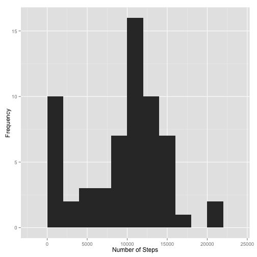
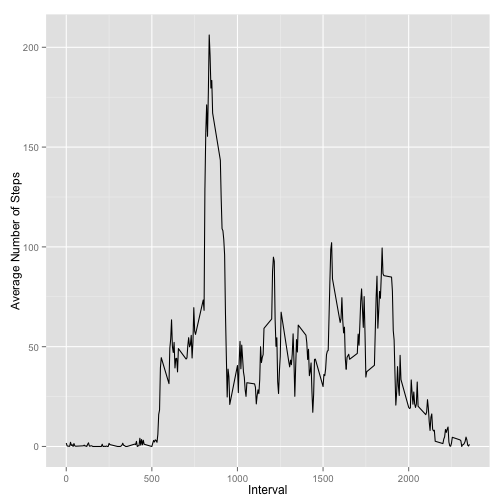
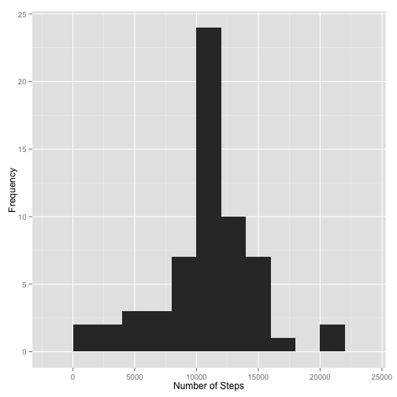
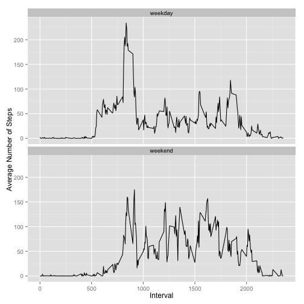

## Loading and preprocessing the data


```r
data <- read.csv(unz("activity.zip", "activity.csv"), 
                 header=TRUE, 
                 stringsAsFactors=FALSE)
# Turn the dates into actual Dates
data$date <- as.Date(data$date)
```

## What is mean total number of steps taken per day?


```r
# Calculate the total number of steps taken per day
total.steps.per.day <- aggregate(data$steps, list(data$date), sum, na.rm = TRUE)
names(total.steps.per.day) <- c("date", "steps")
ggplot(total.steps.per.day, aes(x=steps)) + 
  geom_histogram(binwidth=2000) +
  xlab("Number of Steps") +
  ylab("Frequency")
```

 

The mean total number of steps taken each day is __9354.23__ and the median is __10395__.

## What is the average daily activity pattern?


```r
avg.steps.per.interval <- aggregate(data$steps, list(data$interval), mean, na.rm = TRUE)
names(avg.steps.per.interval) <- c("interval", "avg.steps")
ggplot(avg.steps.per.interval, aes(x=interval, y=avg.steps)) + 
  geom_line() +
  xlab("Interval") +
  ylab("Average Number of Steps")
```

 

The 5-minute interval that contains the maximum number of steps, on average across all days in the dataset, is the interval ____.

## Imputing missing values

The total number of records with missing values is __2304__.


```r
# Create a new attribute to hold the steps each observation with the missing 
# values filled in with the mean for the interval of the current observation
data$imputed.steps <- data$steps
# Get a list of the average number of steps for the interval of the current 
# observation
avg.steps <- avg.steps.per.interval[
  match(data$interval, avg.steps.per.interval$interval), "avg.steps"]
data[is.na(data$imputed.steps), "imputed.steps"] <- 
  avg.steps[is.na(data$imputed.steps)]

# Recalculate the total number of steps a day with imputed values
total.imputed.steps <- aggregate(data$imputed.steps, list(data$date), sum)
names(total.imputed.steps) <- c("date", "steps")
ggplot(total.imputed.steps, aes(x=steps)) +
  geom_histogram(binwidth=2000) +
  xlab("Number of Steps") +
  ylab("Frequency")
```

 

The mean total number of steps taken each day is __10766.19__ and the median is __10766.19__.

The values above differ from the earlier mean and median values. Specifically, they are both higher than the original averages. Imputing the missing values has removed the spike we saw around lowest intervals and has intesified the rest of the values in the histogram.

## Are there differences in activity patterns between weekdays and weekends?


```r
# Add a new column to the data called date.type which is a factor with values
# "weekend" and "weekday" based on the date for the current observation.
is.weekend = function(date) { weekdays(date) %in% c("Saturday", "Sunday") }
data$date.type <- as.factor(c("weekday", "weekend")[is.weekend(data$date) + 1])

# Create a data frame with the average steps per interval and date type
df <- aggregate(data$steps, list(data$interval, data$date.type), mean, na.rm=TRUE)
names(df) <- c("interval", "date.type", "avg.steps")

# Plot the average number of steps per interval faceted on the date type
ggplot(df, aes(interval, avg.steps)) + 
  geom_line() + 
  facet_wrap(~date.type, ncol=1) +
  xlab("Interval") +
  ylab("Average Number of Steps")
```

 
